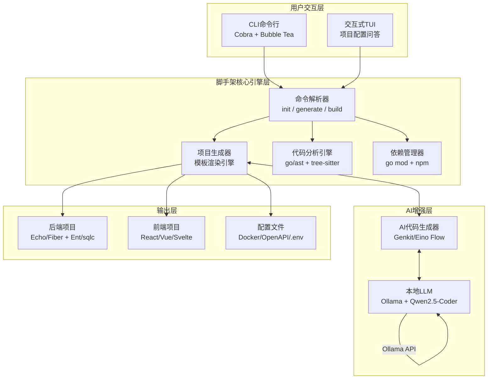

## 第一部分：选题填表

| **类别** | **编号** | **题目** | **限报** | **要求** | **需求概述** | **担任角色** | **建议方案** | **建议语言** | **成果形式** |
|:---:|:---:|:---|:---:|:---:|:---|:---|:---|:---:|:---|
| **Rust和Go高并发架构** | 9 | **Golang AI原生全栈应用快速开发脚手架** | 3 | | 基于Go语言构建一个AI原生全栈应用快速开发框架，实现从项目初始化到部署的全流程加速。系统提供CLI命令行工具，支持通过自然语言描述生成完整项目结构、REST API端点、数据库模型和CRUD代码；集成本地LLM（Ollama）实现代码自动生成与补全；后端采用高性能Web框架（Echo/Fiber/Gin），前端提供React/Vue/Svelte等多种模板；支持多种数据库ORM（Ent/sqlc/GORM）一键配置；内置OpenAPI 3.1文档自动生成、JWT认证脚手架、Docker部署配置。典型场景：后端开发者5分钟内启动一个全栈项目，降低重复劳动，提升开发效率。 | 架构师，后端，前端 | **CLI工具**：Cobra + Viper + Bubble Tea（交互式TUI）+ Lipgloss<br>**后端框架**：Echo/Fiber + Huma（OpenAPI驱动）+ Ent/sqlc + slog结构化日志 + OpenTelemetry<br>**AI集成**：Genkit Go（Google开源AI框架）或CloudWeGo Eino（大模型应用框架）+ Ollama（本地Qwen2.5-Coder/DeepSeek-Coder）+ Reqwest HTTP客户端<br>**前端模板**：React 19 + TypeScript + Vite / Vue 3 + Pinia + Vite / Svelte 5<br>**代码生成**：text/template模板引擎 + go/ast（Go AST解析）+ tree-sitter（多语言解析）<br>**部署**：Docker + GitHub Actions + Vercel（前端） | Go + TypeScript | 系统、设计报告 |


## 第二部分：完整设计方案与开发思路（2周版）

### 一、选题背景与价值定位

当前,Go 已经成为构建云原生后端服务的主流语言，占据新云原生Web服务的42%，而Gin一家的市场份额就达到了94%。Go语言生态在过去几年发生了三大变化：一是Web框架日趋成熟——Fiber 3.0吞吐量达142,000 req/s，较Gin 1.10提升2.1倍；二是框架与生态理念发生了由规模化到可维护性的转向——工具与理念更强调长期维护性和API标准化；三是AI能力加速渗透——谷歌Genkit Go和CloudWeGo Eino等框架将AI编排能力带到Go生态的最前沿。

本项目的核心价值在于：让学生在2周内构建一个创新性的AI驱动开发工具，将Golang Web后端开发能力与最新AI应用框架相结合，解决“重复造轮子”这一开发效率痛点，产出可极大提升个人和团队开发效率的真实工具。


### 二、选题方案说明

本题目提供**两套实现方案**供团队选择，可根据学生技术基础和兴趣方向自由决定：

**方案A**（本题填表默认方案）：AI驱动的脚手架生成工具——聚焦“项目生成”，通过自然语言描述生成完整后端代码，重点在于CLI工具设计、AI能力集成和模板引擎。

**方案B**（团队可选）：AI应用后端服务——聚焦“AI编排服务”，基于Genkit Go或Eino框架构建支持多模型调用、RAG检索的AI应用后端，重点在于AI管道编排和多模态调用。

本设计的详细方案以方案A为主线展开，方案B作为团队可选拓展方向在最后说明。


### 三、系统架构设计




### 四、核心功能模块设计（2周可完成）

#### 模块1：CLI脚手架框架（Cobra + Bubble Tea）

构建命令行工具骨架，支持三个核心命令：

| 命令 | 功能 | 示例 |
|:---|:---|:---|
| `init` | 初始化新项目（TUI交互式问答） | `scaffold init my-api --backend echo --db postgres` |
| `generate` | 基于自然语言生成业务代码（AI增强） | `scaffold generate "user CRUD operations with JWT auth"` |
| `build` | 构建并打包项目（Docker + 二进制） | `scaffold build --docker` |

使用`cobra`实现命令行解析，`viper`处理配置管理，集成`bubbletea`（Bubble Tea）实现交互式终端UI——用户在终端内通过方向键选择后端框架（Echo/Fiber/Gin）、ORM（Ent/sqlc/GORM）、数据库（PostgreSQL/MySQL/SQLite）和前端模板（React/Vue/Svelte），生成个性化项目配置。

#### 模块2：后端项目脚手架

脚手架生成的完整后端项目包含以下核心组件：

- **Web框架**：提供Echo/Fiber/Gin三种模板供选择。在2026年的Go Web框架生态中，Echo简化了错误处理，允许handler直接返回error并支持集中式配置；Fiber 3.0性能最优，纯文本吞吐量达142,000 req/s；Gin拥有最庞大的社区生态（94%市场份额），适合更关注长期维护性的生产环境。

- **ORM与类型安全**：提供Ent和sqlc两种类型安全的代码生成方案。Ent通过代码生成将数据库schema转换为类型安全的Go代码，支持IDE自动补全和编译时检查，彻底告别反射开销和字符串字段的拼写错误。

- **API规范与文档**：集成Huma框架，通过声明式struct定义将业务逻辑直接绑定到OpenAPI 3.1规范——如果代码编译通过，API文档自动保证准确。

- **可观测性**：开箱即用`log/slog`结构化JSON日志，后续可扩展OpenTelemetry eBPF自动插桩。

#### 模块3：AI增强代码生成（Genkit/Eino集成）

这是本项目的核心创新点。基于谷歌开源的Genkit Go框架或CloudWeGo Eino框架，实现两个核心AI能力：

**① 自然语言生成CRUD代码（核心能力）**

```go
// 方案A核心：使用Genkit DefineFlow定义代码生成流程
codeGenFlow := genkit.DefineFlow(g, "codeGenerator",
    func(ctx context.Context, input *GenerateInput) (*GeneratedCode, error) {
        prompt := fmt.Sprintf(
            "Generate Go CRUD code for a %s entity with fields: %v. "+
            "Use %s framework, %s ORM. Include validation and error handling.",
            input.EntityName, input.Fields, input.Framework, input.ORM,
        )
        // 调用本地Ollama模型生成代码
        return callLLM(ctx, prompt)
    })
```

用户在终端输入“生成用户登录注册API，使用Echo框架和JWT鉴权”，AI模型可自主规划生成对应的路由、handler、JWT中间件配置和数据库模型代码。

**② 代码补全与修复**：在现有项目中集成代码智能补全能力，输入“编写一个函数，输入用户ID，返回用户订单列表”，AI基于上下文自动生成完整的函数代码并插入到指定文件。

**AI模型选型**：使用Ollama运行Qwen2.5-Coder 7B或DeepSeek-Coder 6.7B的4-bit/8-bit量化版本（内存约4GB，消费级笔记本电脑可运行），通过Genkit Go的插件体系统一调用。

2026年，AI辅助编程正从辅助工具演进为自主开发者。本项目让AI来生成80%的样板代码（CRUD、认证、配置、测试），学生专注于20%的业务逻辑创新。

#### 模块4：前端脚手架集成

脚手架可选择性生成前端项目，通过Go内置的`text/template`引擎渲染前端模板：

- **React 19**：TypeScript + Vite + TailwindCSS + TanStack Router
- **Vue 3**：Pinia + Vite + Element Plus/Ant Design Vue
- **Svelte 5**：SvelteKit + TailwindCSS

后端自动生成OpenAPI规范文件（3.1），前端可基于该文件使用`openapi-typescript`自动生成TypeScript API客户端类型，实现前后端类型完全一致。

#### 模块5：Docker与CI/CD自动配置

脚手架生成的Dockerfile采用多阶段构建：
- 第一阶段：Go编译（`go build -ldflags "-s -w"`，去除调试信息和符号表，减小二进制体积）
- 第二阶段：Alpine Linux运行二进制（镜像最终压缩至~20MB）
- 同时生成`.github/workflows/ci.yml`，配置测试、Linter检查和自动部署

### 五、开发路线图（2周/10个工作日）

| 阶段 | 天数 | 任务 | 输出物 |
|:---|:---|:---|:---|
| **第1-2天** | 2 | 项目初始化；Cobra CLI框架搭建；三大核心命令结构定义 | 可运行的CLI工具骨架 |
| **第3-4天** | 2 | 后端模板设计（Echo/Fiber/Gin + Ent/sqlc + 配置文件）；模板渲染引擎 | 可选择后端框架生成项目 |
| **第5-6天** | 2 | Genkit Go/Eino框架集成；对接Ollama本地模型；实现CRUD代码生成Flow | AI增强代码生成能力 |
| **第7-8天** | 2 | 前端模板集成（React/Vue/Svelte）；OpenAPI自动生成与前端类型同步 | 前后端项目完整生成 |
| **第9-10天**| 2 | Docker/CI配置生成；Bubble Tea TUI完善；测试与优化；撰写项目报告 | 完整交付 |

**简化与聚焦策略**：
- **后端框架**：2周内选择一个框架优先实现完整模板（推荐Echo），其他框架作为扩展参考模板。
- **AI生成范围**：优先实现CRUD代码生成，代码补全与修复作为拓展功能。
- **前端集成**：优先实现React模板，通过OpenAPI自动生成TypeScript客户端即可。Vue/Svelte作为拓展。
- **数据库**：优先实现PostgreSQL + Ent的组合，SQLite可作为测试数据库简化调试。


### 六、技术挑战与解决策略

| 挑战 | 解决策略 |
|:---|:---|
| AI生成代码的质量与一致性 | 通过精心设计的Prompt模板和few-shot示例提高输出质量；使用go/ast解析生成的Go代码验证语法正确性，不合格则要求AI重试 |
| Genkit/Eino框架的学习曲线 | 2周内聚焦核心Flow定义和模型调用API，暂不深入Graph/Workflow编排等高级特性 |
| 本地LLM运行资源占用 | 使用Qwen2.5-Coder 1.5B量化版（约1GB），在轻薄本上也能流畅运行，且对Go代码生成效果仍保持良好 |
| 模板维护复杂度 | 采用“脚手架生成脚手架”的思路——模板自身通过代码生成机制维护，降低后期维护压力 |


### 七、验证方案

**功能验证**：
1. `scaffold init my-project`：交互式选择Echo+Ent+PostgreSQL+React，成功生成完整项目并可`go run`启动
2. `scaffold generate "product CRUD with category filter"`：AI生成对应的handler和数据库模型，注入现有项目后编译通过
3. 生成的OpenAPI文档通过Swagger UI正确展示所有端点

**性能指标**：
- 项目生成时间：< 3秒（不含模型预热）
- AI代码生成时间：< 15秒（本地模型推理）
- 生成的二进制大小：< 25 MB
- 支持生成超过10种后端+前端组合

### 八、拓展方向

**方案B（团队可选）- AI应用后端服务方向**：
- 基于Genkit Go框架构建支持多模型（OpenAI/Claude/Gemini/Ollama）统一调用的AI应用后端
- 集成CloudWeGo Eino的编排能力，实现多智能体协作或人机协作中断机制
- 支持RAG检索增强，可接入向量数据库（Milvus/Qdrant）
- 提供流式响应（SSE）支持，适用于聊天类和生成式应用

其他拓展方向：
- **插件生态**：支持第三方插件扩展（数据库驱动、前端框架模板）
- **可视化编辑器**：开发基于Wails的跨平台桌面客户端，通过拖拽UI配置生成项目
- **私有化部署模板**：生成支持K8s部署的完整YAML配置集


### 九、成果形式

- 源代码仓库（GitHub），包含完整README.md（安装说明、使用示例、API文档）
- 预编译的二进制发布包（支持Windows/macOS/Linux）
- 使用本项目脚手架生成一个真实的Demo应用（如待办事项管理系统），并部署到云端
- 项目设计报告（需求分析、架构设计、核心模块实现说明、测试验证结果）