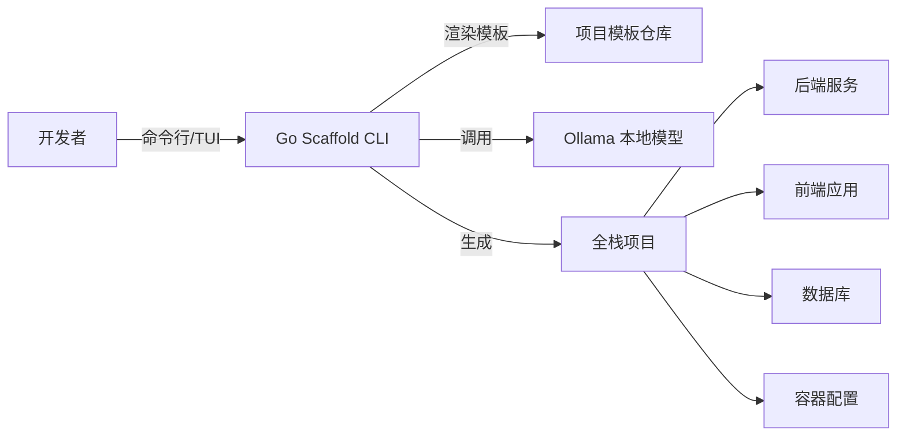
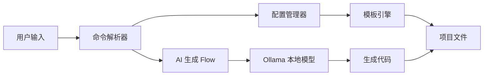

# 需求规格说明书

## 1. 引言

### 1.1 编写目的

本文档是"Golang AI 原生全栈应用快速开发脚手架"（以下简称"Go Scaffold"或"本系统"）的需求规格说明书（Software Requirements Specification，SRS）。编写目的在于：

1. 明确系统的功能需求、非功能需求、接口需求和数据需求，为后续系统设计、开发、测试和验收提供依据。
2. 作为项目团队内部沟通的基础，确保开发人员对项目目标和边界有统一理解。
3. 作为项目评审、专家意见征集和整改的重要参考资料。

本文档面向的读者包括：项目开发人员、测试人员、指导教师、评审专家以及后续维护人员。

### 1.2 项目背景

随着 Go 语言在云原生后端开发中的普及，开发者在启动新项目时面临大量重复性配置工作，包括 Web 框架选型、ORM 配置、数据库初始化、认证授权、日志监控、API 文档、容器化部署等。同时，以 GPT、Qwen、DeepSeek 为代表的大语言模型（LLM）为代码自动生成提供了新的可能性。

本项目旨在构建一个 AI 原生的 Go 全栈应用快速开发脚手架，通过命令行工具（CLI）实现项目初始化、模板渲染、AI 代码生成、依赖管理和部署配置生成，帮助开发者在几分钟内获得一个可运行的全栈项目骨架。

### 1.3 术语与缩略语

| 术语/缩略语 | 说明 |
|:---|:---|
| CLI | Command Line Interface，命令行界面 |
| TUI | Text-based User Interface，文本用户界面 |
| LLM | Large Language Model，大语言模型 |
| ORM | Object-Relational Mapping，对象关系映射 |
| API | Application Programming Interface，应用程序接口 |
| OpenAPI | 一种用于描述 REST API 的规范，本系统采用 OpenAPI 3.1 |
| JWT | JSON Web Token，一种用于认证的开放标准 |
| CRUD | Create、Read、Update、Delete，常见的数据操作 |
| Cobra | Go 语言中流行的 CLI 框架 |
| Bubble Tea | Go 语言中用于构建 TUI 的框架 |
| Genkit Go | Google 开源的 Go 语言 AI 应用框架 |
| Ollama | 本地运行大语言模型的工具 |
| Ent | Facebook 开源的 Go 语言实体框架 |
| Huma | Go 语言中支持 OpenAPI 3.1 的 Web 框架 |

### 1.4 参考资料

1. 《计算机学院 2025 年秋季学期 22 级软件工程专业软件工程项目实训需要提交的考核资料要求》
2. 《09 Golang AI 原生全栈应用快速开发脚手架.md》选题说明
3. Go 官方文档：https://go.dev/doc/
4. Cobra 官方文档：https://github.com/spf13/cobra
5. Bubble Tea 官方文档：https://github.com/charmbracelet/bubbletea
6. Genkit Go 官方文档：https://github.com/firebase/genkit
7. Ent 官方文档：https://entgo.io/
8. Echo 官方文档：https://echo.labstack.com/
9. OpenAPI 3.1 规范：https://spec.openapis.org/oas/v3.1.0

### 1.5 文档组织

本文档共分为七个章节：引言、总体描述、功能性需求、非功能性需求、外部接口需求、数据需求和其他需求。每个章节从不同角度对系统需求进行详细描述。

## 2. 总体描述

### 2.1 产品视角

Go Scaffold 是一个独立的命令行工具，运行在个人开发者的本地机器上。它通过读取用户输入（命令行参数或 TUI 交互选择），从内置模板仓库中渲染生成项目文件，并可选择调用本地 Ollama 模型生成业务代码。生成的项目是一个完整的全栈应用，包含后端服务、前端应用、数据库模型、API 文档、测试和部署配置。

本系统与外部系统的关系如下图所示：



### 2.2 产品功能

本系统的核心功能包括：

1. **项目初始化（`init`）**：通过交互式问答收集项目配置，生成完整的项目目录结构和基础文件。
2. **AI 代码生成（`generate`）**：根据自然语言描述，调用本地 LLM 生成 CRUD 代码、handler、模型等。
3. **项目构建（`build`）**：编译生成的后端项目，打包 Docker 镜像或生成可执行文件。
4. **模板管理**：支持后端框架、ORM、数据库、前端框架等多种模板的组合。
5. **配置管理**：通过 Viper 管理脚手架自身配置和生成项目的配置。
6. **日志与错误处理**：提供清晰的日志输出和友好的错误提示。

### 2.3 用户特征

本系统的主要用户群体包括：

| 用户类型 | 技术水平 | 使用场景 |
|:---|:---|:---|
| 高校学生 | 中等 | 课程实训、毕业设计、技术学习 |
| 独立开发者 | 中高 | 快速启动个人项目 |
| 后端开发者 | 中高 | 需要快速生成前后端项目骨架 |
| 小型团队 | 中高 | 统一项目结构和开发规范 |

### 2.4 运行环境

#### 2.4.1 开发环境

- 操作系统：Windows 10/11、macOS 12+、Linux（Ubuntu 22.04+）
- Go 版本：1.23 或更高
- Node.js 版本：20.x 或更高（用于生成前端项目）
- Docker：24.x 或更高（可选，用于容器化部署）
- Ollama：0.3.x 或更高（可选，用于 AI 代码生成）

#### 2.4.2 生成项目运行环境

- 后端：Go 1.23+
- 前端：Node.js 20.x+
- 数据库：PostgreSQL 15+、MySQL 8.0+ 或 SQLite 3

### 2.5 约束条件

1. **时间约束**：项目周期为 2 周（10 个工作日），需优先保证核心功能可用。
2. **资源约束**：AI 代码生成依赖本地 LLM，需考虑普通笔记本电脑的硬件限制。
3. **技术约束**：脚手架本身使用 Go 语言开发，生成的后端项目也使用 Go 语言。
4. **许可约束**：使用开源工具和框架时，需遵守相应的开源协议。

### 2.6 假设与依赖

1. 用户已安装 Go 1.23+ 和 Git。
2. 用户使用 AI 代码生成功能时，已本地安装并运行 Ollama。
3. 生成的项目默认使用 Echo + Ent + PostgreSQL + React 技术栈，其他组合作为扩展支持。
4. 用户具备基本的命令行操作能力和 Go 语言开发基础。

## 3. 功能性需求

### 3.1 CLI 命令解析

#### 3.1.1 需求编号：FR-CLI-001

**需求描述**：系统应提供一个名为 `go-scaffold` 的可执行文件作为 CLI 入口。

**输入**：用户在终端中输入命令，例如 `go-scaffold init my-project`。

**处理**：CLI 使用 Cobra 框架解析命令和参数。

**输出**：根据命令类型执行相应操作，并输出执行结果或错误信息。

#### 3.1.2 需求编号：FR-CLI-002

**需求描述**：系统应支持 `init`、`generate`、`build` 三个核心命令。

| 命令 | 说明 |
|:---|:---|
| `init` | 初始化新项目 |
| `generate` | 基于自然语言描述生成业务代码 |
| `build` | 构建并打包项目 |

#### 3.1.3 需求编号：FR-CLI-003

**需求描述**：每个命令应支持 `--help` 参数，显示该命令的使用说明、参数列表和示例。

#### 3.1.4 需求编号：FR-CLI-004

**需求描述**：CLI 应支持全局配置，例如默认后端框架、默认 ORM、模型地址、日志级别等。配置可通过配置文件、环境变量或命令行参数覆盖。

### 3.2 项目初始化（`init`）

#### 3.2.1 需求编号：FR-INIT-001

**需求描述**：用户执行 `go-scaffold init <project-name>` 时，系统应创建以项目名命名的目录，并在该目录下生成完整的项目结构。

#### 3.2.2 需求编号：FR-INIT-002

**需求描述**：如果没有通过命令行参数指定配置，系统应启动交互式 TUI，引导用户选择以下配置项：

- 后端框架：Echo（默认）、Fiber、Gin
- ORM：Ent（默认）、sqlc、GORM
- 数据库：PostgreSQL（默认）、MySQL、SQLite
- 前端框架：React 19 + TypeScript + Vite（默认）、Vue 3、Svelte 5
- 是否启用 JWT 认证
- 是否生成 Docker 配置
- 是否生成 GitHub Actions CI/CD 配置

#### 3.2.3 需求编号：FR-INIT-003

**需求描述**：生成的后端项目应包含以下目录和文件：

```
<project-name>/
├── cmd/
│   └── server/
│       └── main.go
├── internal/
│   ├── config/
│   ├── handler/
│   ├── model/
│   ├── service/
│   └── middleware/
├── ent/
│   └── schema/
├── migrations/
├── pkg/
│   └── utils/
├── api/
│   └── openapi.yaml
├── tests/
├── Dockerfile
├── docker-compose.yml
├── go.mod
├── go.sum
├── Makefile
├── README.md
└── .env.example
```

#### 3.2.4 需求编号：FR-INIT-004

**需求描述**：生成的前端项目应包含以下目录和文件：

```
<project-name>-web/
├── public/
├── src/
│   ├── components/
│   ├── pages/
│   ├── api/
│   ├── stores/
│   ├── types/
│   ├── App.tsx
│   └── main.tsx
├── package.json
├── tsconfig.json
├── vite.config.ts
├── Dockerfile
└── README.md
```

#### 3.2.5 需求编号：FR-INIT-005

**需求描述**：系统应根据用户选择的数据库类型，生成对应的数据库连接配置和初始化脚本。

#### 3.2.6 需求编号：FR-INIT-006

**需求描述**：如果用户选择启用 JWT 认证，系统应自动生成 JWT 中间件、登录/注册 handler 示例和 `.env` 中的密钥配置。

### 3.3 模板渲染

#### 3.3.1 需求编号：FR-TPL-001

**需求描述**：系统应使用 Go 内置的 `text/template` 作为模板引擎，支持变量替换、条件渲染和循环渲染。

#### 3.3.2 需求编号：FR-TPL-002

**需求描述**：模板文件应按照后端框架、ORM、数据库、前端框架进行分类管理，便于扩展和维护。

#### 3.3.3 需求编号：FR-TPL-003

**需求描述**：系统应支持模板变量注入，例如项目名称、模块路径、框架名称、数据库连接字符串等。

#### 3.3.4 需求编号：FR-TPL-004

**需求描述**：模板渲染过程中出现错误时，系统应输出详细的错误信息，包括模板文件路径、行号和错误原因。

### 3.4 AI 代码生成（`generate`）

#### 3.4.1 需求编号：FR-AI-001

**需求描述**：用户执行 `go-scaffold generate "<description>"` 时，系统应将描述文本转换为结构化的生成请求，并调用本地 LLM 生成对应的代码。

#### 3.4.2 需求编号：FR-AI-002

**需求描述**：系统应支持生成以下类型的代码：

- 数据库模型（Ent Schema）
- RESTful API handler
- Service 层业务逻辑
- 路由注册代码
- JWT 认证中间件
- 单元测试代码

#### 3.4.3 需求编号：FR-AI-003

**需求描述**：系统应使用 Genkit Go 定义代码生成 Flow，统一管理 Prompt、模型调用和输出解析。

#### 3.4.4 需求编号：FR-AI-004

**需求描述**：系统应内置高质量的 Prompt 模板，明确指定输出格式（如仅返回 Go 代码、使用指定的框架和 ORM、包含错误处理等）。

#### 3.4.5 需求编号：FR-AI-005

**需求描述**：生成的代码应使用 `go/ast` 进行语法校验。如果语法校验失败，系统应提示用户并允许重新生成。

#### 3.4.6 需求编号：FR-AI-006

**需求描述**：系统应支持指定目标文件路径，将生成的代码写入现有项目的指定位置，或创建新文件。

#### 3.4.7 需求编号：FR-AI-007

**需求描述**：如果本地 Ollama 服务未启动或模型不可用，系统应给出清晰的错误提示，并提供安装和启动指引。

### 3.5 依赖管理

#### 3.5.1 需求编号：FR-DEP-001

**需求描述**：系统生成的后端项目应自动初始化 `go.mod`，并根据用户选择添加正确的依赖项。

#### 3.5.2 需求编号：FR-DEP-002

**需求描述**：生成的前端项目应自动初始化 `package.json`，并安装必要的依赖（如 React、Vite、TypeScript、TailwindCSS 等）。

#### 3.5.3 需求编号：FR-DEP-003

**需求描述**：系统应提供 `go mod tidy` 和 `npm install` 的自动执行选项，或在文档中说明手动执行步骤。

### 3.6 项目构建（`build`）

#### 3.6.1 需求编号：FR-BLD-001

**需求描述**：用户执行 `go-scaffold build` 时，系统应编译生成的后端项目，生成可执行二进制文件。

#### 3.6.2 需求编号：FR-BLD-002

**需求描述**：如果用户指定 `--docker` 参数，系统应构建 Docker 镜像，镜像采用多阶段构建以减小体积。

#### 3.6.3 需求编号：FR-BLD-003

**需求描述**：构建过程中应输出编译日志，失败时显示详细的错误信息。

### 3.7 配置管理

#### 3.7.1 需求编号：FR-CFG-001

**需求描述**：系统应使用 Viper 管理自身配置，支持 YAML、JSON、TOML 格式的配置文件。

#### 3.7.2 需求编号：FR-CFG-002

**需求描述**：生成的项目应使用环境变量和配置文件相结合的方式管理运行时配置。

#### 3.7.3 需求编号：FR-CFG-003

**需求描述**：系统应为生成的项目创建 `.env.example` 文件，列出所有需要配置的环境变量。

### 3.8 日志与错误处理

#### 3.8.1 需求编号：FR-LOG-001

**需求描述**：系统应使用 `log/slog` 输出结构化日志，支持文本和 JSON 两种格式。

#### 3.8.2 需求编号：FR-LOG-002

**需求描述**：日志应包含时间戳、日志级别、消息内容和相关上下文信息。

#### 3.8.3 需求编号：FR-ERR-001

**需求描述**：系统应对常见错误进行分类处理，包括文件已存在、模板未找到、Ollama 连接失败、模型返回格式错误等。

#### 3.8.4 需求编号：FR-ERR-002

**需求描述**：错误信息应使用中文显示，便于国内用户理解。

## 4. 非功能性需求

### 4.1 性能需求

#### 4.1.1 需求编号：NFR-PERF-001

**需求描述**：项目初始化（不含 AI 代码生成）应在 3 秒内完成。

#### 4.1.2 需求编号：NFR-PERF-002

**需求描述**：AI 代码生成单次请求（本地模型预热后）应在 15 秒内返回结果。

#### 4.1.3 需求编号：NFR-PERF-003

**需求描述**：生成的后端二进制文件体积应小于 25 MB（使用 `-ldflags "-s -w"` 编译优化）。

### 4.2 可靠性需求

#### 4.2.1 需求编号：NFR-REL-001

**需求描述**：系统在生成项目过程中遇到错误时，应尽可能保持已生成文件的完整性，避免部分文件残留导致项目无法使用。

#### 4.2.2 需求编号：NFR-REL-002

**需求描述**：AI 代码生成失败时，系统应允许用户重试，并提供重试次数限制（默认 3 次）。

### 4.3 可用性需求

#### 4.3.1 需求编号：NFR-USE-001

**需求描述**：CLI 的交互式 TUI 应提供清晰的提示和默认选项，用户可通过方向键和回车完成配置。

#### 4.3.2 需求编号：NFR-USE-002

**需求描述**：所有命令应支持 `--help`，帮助信息应包含命令用途、参数说明和示例。

#### 4.3.3 需求编号：NFR-USE-003

**需求描述**：生成的项目应包含 README.md，说明如何安装依赖、运行项目、执行迁移和部署。

### 4.4 安全性需求

#### 4.4.1 需求编号：NFR-SEC-001

**需求描述**：生成的 JWT 认证项目应使用强随机密钥，并在 `.env` 中配置，禁止硬编码在源代码中。

#### 4.4.2 需求编号：NFR-SEC-002

**需求描述**：系统不应将用户代码或项目信息上传到远程服务器，所有 AI 推理均在本地完成。

#### 4.4.3 需求编号：NFR-SEC-003

**需求描述**：生成的项目应包含 `.gitignore` 文件，避免敏感配置文件（如 `.env`）被提交到版本控制。

### 4.5 可维护性需求

#### 4.5.1 需求编号：NFR-MAINT-001

**需求描述**：脚手架源代码应遵循 Go 官方代码规范，函数、结构体、变量等应添加中文注释。

#### 4.5.2 需求编号：NFR-MAINT-002

**需求描述**：模板文件应独立存放，与 CLI 逻辑解耦，便于后续新增或修改模板。

### 4.6 可扩展性需求

#### 4.6.1 需求编号：NFR-EXT-001

**需求描述**：系统应支持通过插件或新增模板目录的方式扩展后端框架、ORM、数据库和前端框架。

#### 4.6.2 需求编号：NFR-EXT-002

**需求描述**：AI 代码生成模块应支持切换不同的本地模型（如 Qwen2.5-Coder、DeepSeek-Coder），模型配置应可通过配置文件修改。

### 4.7 兼容性需求

#### 4.7.1 需求编号：NFR-COMP-001

**需求描述**：CLI 工具应兼容 Windows、macOS 和 Linux 三个主流操作系统。

#### 4.7.2 需求编号：NFR-COMP-002

**需求描述**：生成的项目代码应兼容 Go 1.23+ 和 Node.js 20.x+。

## 5. 外部接口需求

### 5.1 用户接口

#### 5.1.1 命令行接口

系统通过终端与用户交互，支持的命令格式如下：

```bash
# 初始化新项目
go-scaffold init <project-name> [flags]

# 基于自然语言生成代码
go-scaffold generate "<description>" [flags]

# 构建项目
go-scaffold build [flags]
```

#### 5.1.2 交互式 TUI 接口

当用户未提供完整参数时，系统启动 Bubble Tea 驱动的 TUI，显示选择列表、输入框和确认按钮。TUI 应支持键盘导航：

- `↑` / `↓`：上下移动选项
- `Enter`：确认选择
- `Tab`：切换输入框
- `Esc` / `Ctrl+C`：取消操作

### 5.2 软件接口

#### 5.2.1 Ollama API 接口

系统通过 HTTP 调用本地 Ollama 的 `/api/generate` 接口进行 AI 代码生成。请求和响应格式如下：

**请求示例**：

```json
{
  "model": "qwen2.5-coder:7b",
  "prompt": "Generate Go CRUD code for a User entity...",
  "stream": false,
  "options": {
    "temperature": 0.2
  }
}
```

**响应示例**：

```json
{
  "model": "qwen2.5-coder:7b",
  "response": "package main\n...",
  "done": true
}
```

#### 5.2.2 Go 模块接口

生成的后端项目使用标准 Go 模块管理依赖，模块路径格式为 `<module-prefix>/<project-name>`，可通过脚手架配置指定模块前缀。

### 5.3 硬件接口

本系统为纯软件工具，不直接操作特定硬件设备。运行时依赖用户计算机的 CPU、内存和磁盘资源。

### 5.4 通信接口

本系统与本地 Ollama 服务通过 HTTP 协议通信，默认地址为 `http://localhost:11434`。该通信仅在用户主动使用 AI 代码生成功能时发生。

## 6. 数据需求

### 6.1 脚手架自身数据

#### 6.1.1 配置文件

脚手架自身使用配置文件记录用户偏好和默认选项，配置文件位于用户主目录下的 `.go-scaffold/config.yaml`，内容示例：

```yaml
default_backend: echo
default_orm: ent
default_database: postgres
default_frontend: react
ollama_host: http://localhost:11434
ollama_model: qwen2.5-coder:7b
log_level: info
```

#### 6.1.2 项目元数据

脚手架可为每个生成的项目创建 `.go-scaffold.json` 文件，记录生成时的配置参数，便于后续 `generate` 命令了解项目上下文：

```json
{
  "project_name": "my-api",
  "backend": "echo",
  "orm": "ent",
  "database": "postgres",
  "frontend": "react",
  "module_path": "github.com/example/my-api",
  "generated_at": "2025-10-01T10:00:00Z"
}
```

### 6.2 生成项目的数据

#### 6.2.1 数据库模型

生成的后端项目使用 Ent 定义数据库模型。以用户管理为例，Ent Schema 示例：

```go
package schema

import (
    "entgo.io/ent"
    "entgo.io/ent/schema/field"
    "entgo.io/ent/schema/index"
)

type User struct {
    ent.Schema
}

func (User) Fields() []ent.Field {
    return []ent.Field{
        field.Int("id").Positive().Unique(),
        field.String("username").NotEmpty().MaxLen(50),
        field.String("email").NotEmpty(),
        field.String("password_hash").NotEmpty(),
        field.Time("created_at").Default(time.Now),
        field.Time("updated_at").Default(time.Now).UpdateDefault(time.Now),
    }
}

func (User) Indexes() []ent.Index {
    return []ent.Index{
        index.Fields("email").Unique(),
        index.Fields("username").Unique(),
    }
}
```

#### 6.2.2 迁移脚本

生成的项目应包含数据库迁移脚本或 Ent 自动生成迁移命令，支持从零创建数据库表结构。

### 6.3 数据流



## 7. 其他需求

### 7.1 法律与许可

1. 本系统使用开源软件和框架，需遵守相应的开源许可证（如 MIT、Apache-2.0、BSD 等）。
2. 生成的项目默认使用 MIT 许可证，用户可在初始化时选择其他许可证。
3. 本系统本身也作为开源项目发布，采用 MIT 许可证。

### 7.2 国际化

1. 本系统第一版本仅支持中文界面和中文文档。
2. 后续版本可考虑支持英文界面，所有用户可见字符串应集中管理，便于扩展。

### 7.3 文档需求

1. 系统应提供详细的 README.md，包括安装、使用、配置和常见问题。
2. 系统应为每个命令提供 `--help` 说明。
3. 系统应提供示例项目，展示脚手架生成的典型项目结构。

## 8. 附录

### 8.1 功能需求跟踪矩阵

| 需求编号 | 需求名称 | 优先级 | 验收标准 |
|:---|:---|:---:|:---|
| FR-CLI-001 | CLI 入口 | 高 | 可执行 `go-scaffold` 命令 |
| FR-CLI-002 | 三大核心命令 | 高 | `init`、`generate`、`build` 均可执行 |
| FR-INIT-001 | 创建项目目录 | 高 | 成功生成项目目录结构 |
| FR-INIT-002 | 交互式 TUI | 高 | TUI 可正常显示并收集配置 |
| FR-AI-001 | AI 代码生成调用 | 高 | 能调用 Ollama 并返回代码 |
| FR-AI-005 | 代码语法校验 | 中 | 生成的代码能通过 `go/ast` 校验 |
| FR-BLD-001 | 项目构建 | 高 | 生成的项目能成功编译 |
| NFR-PERF-001 | 初始化性能 | 中 | 非 AI 初始化 < 3 秒 |
| NFR-PERF-002 | AI 生成性能 | 中 | AI 生成 < 15 秒 |
| NFR-SEC-002 | 本地推理 | 高 | 不上传用户代码到远程 |

### 8.2 变更记录

| 版本 | 日期 | 修改内容 | 作者 |
|:---:|:---:|:---|:---|
| v1.0 | 2025-10-01 | 初稿完成 | 项目小组 |
