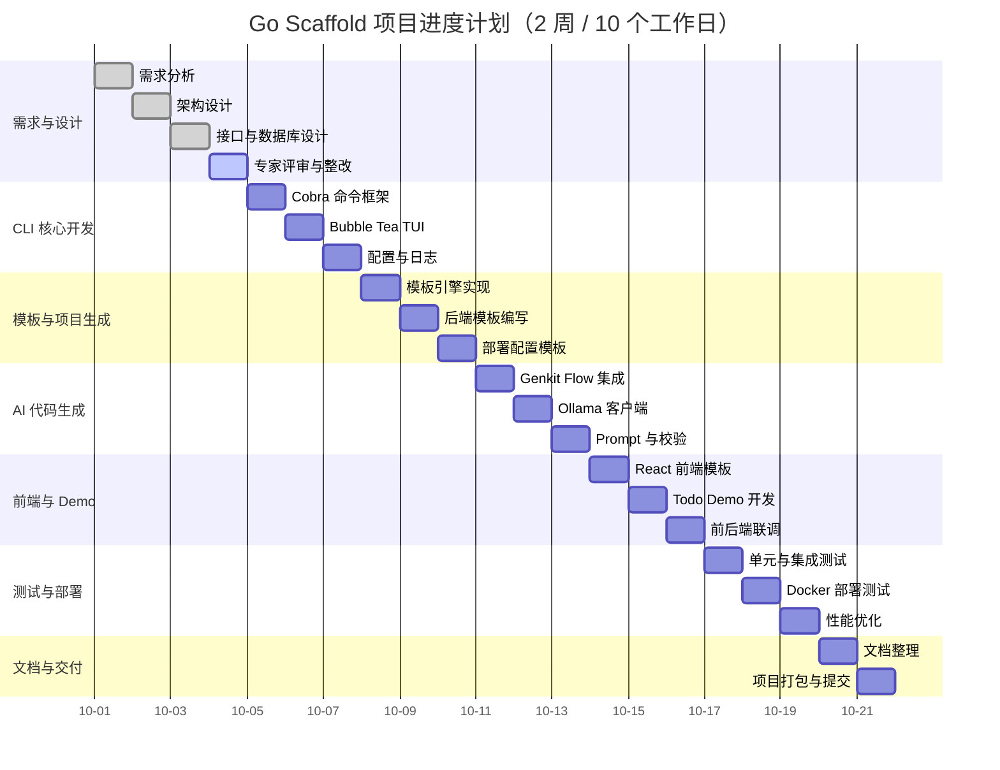

# 项目计划/项目管理计划

## 1. 项目概述

### 1.1 项目名称

**Golang AI 原生全栈应用快速开发脚手架**

### 1.2 项目目标

在 2 周（10 个工作日）内，完成一个基于 Go 语言的 AI 原生全栈应用快速开发脚手架，支持通过 CLI 工具初始化项目、生成 AI 代码、构建部署，并验证其可用性。

### 1.3 项目范围

**包含内容**：

1. CLI 工具核心命令（`init`、`generate`、`build`）
2. 默认技术栈模板（Echo + Ent + PostgreSQL + React 19 + TypeScript + Vite）
3. AI 代码生成模块（基于 Genkit Go + Ollama）
4. 项目构建与 Docker 部署配置
5. Todo Demo 应用
6. 设计文档与测试报告

**不包含内容**：

1. Fiber/Gin 后端框架的完整模板（仅作为扩展说明）
2. Vue/Svelte 前端框架的完整模板（仅作为扩展说明）
3. 商业化运营和长期维护计划
4. 云端 AI 模型调用（仅支持本地 Ollama）

## 2. 工作分解结构（WBS）

```mermaid
graph TD
    A[Go Scaffold 项目] --> B[需求与设计]
    A --> C[CLI 核心开发]
    A --> D[模板与项目生成]
    A --> E[AI 代码生成]
    A --> F[前端与 Demo]
    A --> G[测试与部署]
    A --> H[文档与交付]

    B --> B1[需求分析]
    B --> B2[架构设计]
    B --> B3[接口设计]
    B --> B4[数据库设计]

    C --> C1[Cobra 命令框架]
    C --> C2[Bubble Tea TUI]
    C --> C3[配置管理]
    C --> C4[日志与错误处理]

    D --> D1[模板引擎]
    D --> D2[后端模板]
    D --> D3[部署配置模板]

    E --> E1[Genkit Flow 集成]
    E --> E2[Ollama 客户端]
    E --> E3[Prompt 模板]
    E --> E4[语法校验]

    F --> F1[React 前端模板]
    F --> F2[Todo Demo 页面]
    F --> F3[前后端联调]

    G --> G1[单元测试]
    G --> G2[集成测试]
    G --> G3[Docker 部署测试]
    G --> G4[性能测试]

    H --> H1[设计文档]
    H --> H2[用户手册]
    H --> H3[测试报告]
    H --> H4[项目总结]
```

## 3. 项目进度计划

### 3.1 甘特图

### 3.2 阶段任务明细

#### 第一阶段：需求与设计（第 1-3 天）

| 任务 | 负责人 | 输出物 | 完成标准 |
|:---|:---|:---|:---|
| 需求分析 | 全组 | 《需求规格说明书》 | 功能与非功能需求明确 |
| 架构设计 | 架构师 | 《系统设计文档》 | 架构图、模块划分清晰 |
| 接口与数据库设计 | 后端/前端 | 《接口设计说明书》《数据库说明书》 | 接口定义完整 |
| 专家评审与整改 | 全组 | 《专家评审意见及整改结果》 | 评审意见已整改 |

#### 第二阶段：CLI 核心开发（第 4-6 天）

| 任务 | 负责人 | 输出物 | 完成标准 |
|:---|:---|:---|:---|
| Cobra 命令框架 | 后端 | CLI 命令骨架 | `init`、`generate`、`build` 命令可解析 |
| Bubble Tea TUI | 后端 | 交互式配置界面 | TUI 可收集用户配置 |
| 配置与日志 | 后端 | 配置模块、日志模块 | 配置可加载，日志可输出 |

#### 第三阶段：模板与项目生成（第 7-9 天）

| 任务 | 负责人 | 输出物 | 完成标准 |
|:---|:---|:---|:---|
| 模板引擎实现 | 后端 | 模板渲染模块 | 可渲染文件和目录 |
| 后端模板编写 | 后端 | Echo + Ent 模板 | 生成项目可编译 |
| 部署配置模板 | 后端 | Dockerfile、docker-compose.yml | 支持容器化运行 |

#### 第四阶段：AI 代码生成（第 10-12 天）

| 任务 | 负责人 | 输出物 | 完成标准 |
|:---|:---|:---|:---|
| Genkit Flow 集成 | AI 集成 | AI 生成模块 | Flow 可调用模型 |
| Ollama 客户端 | AI 集成 | Ollama 调用封装 | 可本地调用 Ollama |
| Prompt 与校验 | AI 集成 | Prompt 模板、语法校验 | 生成代码可编译 |

#### 第五阶段：前端与 Demo（第 13-15 天）

| 任务 | 负责人 | 输出物 | 完成标准 |
|:---|:---|:---|:---|
| React 前端模板 | 前端 | 前端项目模板 | 可运行基础 React 项目 |
| Todo Demo 开发 | 前端 | Todo 页面 | 页面功能完整 |
| 前后端联调 | 全组 | 可运行的 Demo | 前后端可通信 |

#### 第六阶段：测试与部署（第 16-18 天）

| 任务 | 负责人 | 输出物 | 完成标准 |
|:---|:---|:---|:---|
| 单元与集成测试 | 测试 | 测试用例与报告 | 核心功能通过测试 |
| Docker 部署测试 | 后端 | 部署报告 | 容器可运行 |
| 性能优化 | 全组 | 优化记录 | 达到性能指标 |

#### 第七阶段：文档与交付（第 19-20 天）

| 任务 | 负责人 | 输出物 | 完成标准 |
|:---|:---|:---|:---|
| 文档整理 | 全组 | 完整设计文档 | 文档齐全 |
| 项目打包与提交 | 全组 | 压缩包 | 按考核要求提交 |

## 4. 资源分配

### 4.1 人力资源

项目小组共 5 人，角色分工如下：

| 角色 | 人数 | 主要职责 |
|:---|---:|:---|
| 组长/架构师 | 1 | 项目整体规划、架构设计、进度把控、文档汇总 |
| 后端开发 | 1 | CLI 命令、模板引擎、后端项目模板、数据库设计 |
| 前端开发 | 1 | React 前端模板、Todo Demo 页面、前后端联调 |
| AI 集成 | 1 | Genkit Go 集成、Ollama 调用、Prompt 设计、语法校验 |
| 测试/文档 | 1 | 测试计划与执行、用户手册、测试报告、项目总结 |

### 4.2 硬件资源

| 资源 | 数量 | 用途 |
|:---|---:|:---|
| 开发用笔记本电脑 | 5 | 日常开发 |
| 实验室测试机 | 1 | Ollama 模型运行与集成测试 |
| 云服务器（可选） | 1 | Demo 部署验证 |

### 4.3 软件资源

| 资源 | 说明 |
|:---|:---|
| Go 1.23+ | 后端与 CLI 开发 |
| Node.js 20.x+ | 前端开发 |
| PostgreSQL 15+ | 数据库 |
| Docker 24.x+ | 容器化部署 |
| Ollama 0.3.x+ | 本地模型运行 |
| VS Code / GoLand | 开发工具 |
| Git / GitHub | 版本控制与代码托管 |

## 5. 里程碑

| 里程碑 | 计划日期 | 交付物 | 验收标准 |
|:---|:---:|:---|:---|
| M1：需求与设计完成 | 第 3 天 | 需求规格说明书、系统设计文档、接口设计说明书、数据库说明书 | 通过专家评审 |
| M2：CLI 工具骨架完成 | 第 6 天 | 可运行的 CLI 命令框架 | 三大命令可解析参数 |
| M3：项目生成能力完成 | 第 9 天 | 可生成完整后端项目 | 生成项目可编译运行 |
| M4：AI 代码生成完成 | 第 12 天 | AI 生成模块 | 可生成可编译的 CRUD 代码 |
| M5：Demo 应用完成 | 第 15 天 | Todo Demo | 前后端联调通过 |
| M6：测试与部署完成 | 第 18 天 | 测试报告、部署报告 | 核心功能测试通过 |
| M7：项目交付 | 第 20 天 | 完整考核材料压缩包 | 按考核要求提交 |

## 6. 风险管理

### 6.1 风险识别与应对

| 风险编号 | 风险描述 | 可能性 | 影响 | 应对措施 |
|:---:|:---|:---:|:---:|:---|
| R1 | AI 生成代码质量不稳定，无法编译 | 中 | 高 | 设计标准化 Prompt，使用 go/ast 校验，失败时重试 |
| R2 | 本地 Ollama 模型运行资源不足 | 中 | 中 | 默认使用 1.5B 量化版，提供资源检测提示 |
| R3 | 多模板组合导致维护复杂度上升 | 中 | 中 | 优先实现默认组合，其他作为扩展 |
| R4 | 第三方依赖版本更新导致不兼容 | 低 | 中 | 固定主要依赖版本，定期验证 |
| R5 | 项目进度延误 | 中 | 高 | 每日站会，关键路径优先，及时调整计划 |
| R6 | 团队成员任务冲突 | 低 | 中 | 明确分工，建立代码审查机制 |

### 6.2 风险监控

1. 每日 17:00 进行 15 分钟站会，汇报进度和阻塞问题。
2. 每周五进行阶段性回顾，评估风险状态并更新应对措施。
3. 关键路径上的任务设置 1 天缓冲时间。

## 7. 沟通计划

### 7.1 沟通方式

| 沟通形式 | 频率 | 参与人 | 内容 |
|:---|:---:|:---|:---|
| 每日站会 | 每天 | 全组 | 昨日完成、今日计划、阻塞问题 |
| 周例会 | 每周一次 | 全组 + 指导教师 | 阶段成果、风险、下周计划 |
| 专家评审 | 关键节点 | 全组 + 评审专家 | 需求/设计评审 |
| 即时通讯 | 随时 | 全组 | 日常问题沟通 |

### 7.2 文档管理

1. 所有设计文档存放在项目 `docs/` 目录下。
2. 文档版本使用 Git 进行管理，重要修改需说明变更内容。
3. 最终交付文档按考核要求命名和打包。

## 8. 质量保证

### 8.1 代码规范

1. 遵循 Go 官方代码规范，使用 `gofmt`、`golint` 进行格式化。
2. 所有函数、结构体、变量添加中文注释。
3. 关键模块编写单元测试，覆盖率不低于 60%。

### 8.2 文档规范

1. 文档使用 Markdown 格式编写。
2. 流程图使用 Mermaid 语法，并在图后附源代码。
3. 甘特图使用 Mermaid 语法，并在图后附源代码。

### 8.3 测试策略

1. 单元测试：覆盖 CLI 命令解析、模板渲染、配置管理等核心模块。
2. 集成测试：验证 `init`、`generate`、`build` 命令的完整流程。
3. 部署测试：验证 Docker 镜像构建和容器运行。
4. 性能测试：验证初始化耗时、AI 生成耗时等关键指标。

## 9. 附录

### 9.1 项目计划变更记录

| 版本 | 日期 | 修改内容 | 作者 |
|:---:|:---:|:---|:---|
| v1.0 | 2025-10-01 | 初稿完成 | 项目小组 |

### 9.2 相关文档

1. 《1-项目提案.md》
2. 《2-1-需求规格说明书.md》
3. 《4-系统设计文档.md》
