# 系统设计文档

## 1. 引言

### 1.1 编写目的

本文档描述"Golang AI 原生全栈应用快速开发脚手架"（以下简称"Go Scaffold"）的系统架构设计、模块划分、数据流设计和技术实现方案。本文档为开发团队提供详细的设计依据，确保各模块实现目标一致、接口清晰、可维护可扩展。

### 1.2 系统概述

Go Scaffold 是一个面向 Go 生态的 AI 原生全栈应用快速开发脚手架。它以一个独立的命令行工具形式运行，提供 `init`、`generate`、`build` 三大核心命令，帮助开发者在几分钟内生成可运行的全栈项目骨架。系统内置可扩展的项目模板引擎，并集成 Genkit Go 与本地 Ollama 模型，实现基于自然语言的代码自动生成。

### 1.3 设计原则

本系统在设计过程中遵循以下原则：

1. **单一职责**：每个模块只负责一项明确职责，模块间通过清晰接口协作。
2. **可扩展性**：模板引擎、AI 框架、后端框架均支持扩展，便于后续增加新选项。
3. **本地化优先**：AI 推理全部在本地完成，保护用户代码隐私，降低使用门槛。
4. **务实聚焦**：在 2 周项目周期内，优先实现默认技术栈（Echo + Ent + PostgreSQL + React），其他选项作为扩展。
5. **可验证性**：关键设计点和性能指标均可通过测试验证。

## 2. 设计目标与约束

### 2.1 设计目标

1. 支持通过交互式 TUI 或命令行参数快速配置新项目。
2. 支持根据用户选择渲染生成后端、前端和部署配置文件。
3. 支持基于自然语言描述生成 Ent Schema、Handler、Service 等代码。
4. 生成的项目具备良好的目录结构、类型安全、可编译、可运行。
5. 提供 Docker 与 CI/CD 配置模板，支持一键式部署。

### 2.2 设计约束

1. **时间约束**：项目周期为 2 周，需优先完成核心路径。
2. **资源约束**：需考虑普通笔记本电脑运行本地 LLM 的资源限制。
3. **技术约束**：脚手架本身与生成后端均使用 Go 语言。
4. **平台约束**：CLI 工具需兼容 Windows、macOS、Linux。

## 3. 技术选型与对比

### 3.1 后端框架选型

| 框架 | 性能 | 生态 | 可维护性 | 本项目选择 |
|:---|:---:|:---:|:---:|:---:|
| Gin | 高（约 70,000 req/s） | 最大（约 94% 市场份额） | 中 | 扩展支持 |
| Echo | 高（约 65,000 req/s） | 大 | 高 | **默认** |
| Fiber | 最高（约 142,000 req/s） | 增长快 | 中 | 扩展支持 |

**选择 Echo 的原因**：

1. Echo 支持 handler 直接返回 error，错误处理更集中。
2. Echo 的中间件机制成熟，文档完善。
3. Echo 在性能和可维护性之间取得良好平衡，适合作为默认模板。

### 3.2 ORM 选型

| ORM | 类型安全 | 学习曲线 | 代码生成 | 本项目选择 |
|:---|:---:|:---:|:---:|:---:|
| GORM | 中 | 低 | 无 | 扩展支持 |
| Ent | 高 | 中 | 有 | **默认** |
| sqlc | 高 | 中 | 有 | 扩展支持 |

**选择 Ent 的原因**：

1. Ent 通过代码生成实现类型安全，避免字符串字段错误。
2. Ent 的 Schema 定义清晰，易于与 AI 生成结合。
3. Ent 支持 PostgreSQL、MySQL、SQLite 多种数据库。

### 3.3 AI 框架选型

| 框架 | 出品方 | 核心能力 | 本项目选择 |
|:---|:---|:---|:---:|
| Genkit Go | Google | Flow 定义、Prompt 管理、模型统一调用 | **默认** |
| CloudWeGo Eino | 字节跳动 | 多模型编排、RAG、Agent | 扩展方向 |

**选择 Genkit Go 的原因**：

1. Genkit Go 的 `DefineFlow` 机制适合将"自然语言生成代码"封装为可复用流程。
2. 2 周内更容易掌握核心 API，不需要深入研究 Graph/Workflow 编排。
3. 社区文档和示例相对丰富。

### 3.4 本地模型选型

| 模型 | 参数量 | 内存占用 | 代码生成能力 | 本项目选择 |
|:---|---:|---:|:---|:---:|
| Qwen2.5-Coder 7B | 7B | 约 4GB（4-bit） | 强 | 推荐 |
| Qwen2.5-Coder 1.5B | 1.5B | 约 1GB | 中 | 最低配置 |
| DeepSeek-Coder 6.7B | 6.7B | 约 4GB | 强 | 可选 |

**默认选择 Qwen2.5-Coder 7B**，同时提供 1.5B 版本作为资源不足时的降级方案。

### 3.5 前端框架选型

| 框架 | 生态 | 类型安全 | 学习曲线 | 本项目选择 |
|:---|:---:|:---:|:---:|:---:|
| React 19 + TS + Vite | 最大 | 高 | 中 | **默认** |
| Vue 3 + TS + Vite | 大 | 高 | 低 | 扩展支持 |
| Svelte 5 | 中 | 高 | 中 | 扩展支持 |

**选择 React 19 的原因**：

1. React 生态最丰富，与 TypeScript 结合成熟。
2. Vite 构建速度快，开发体验好。
3. 通过 OpenAPI 自动生成 TypeScript 类型的流程标准化。

## 4. 系统架构设计

### 4.1 总体架构

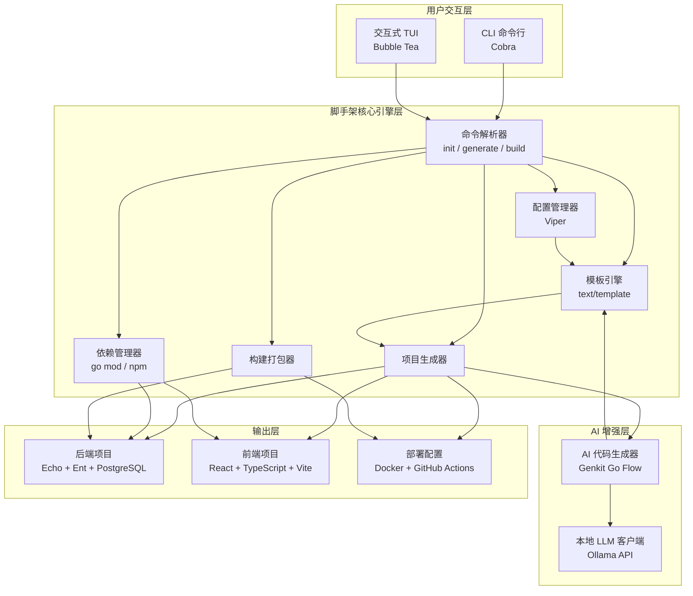

### 4.2 架构说明

1. **用户交互层**：提供命令行接口和交互式 TUI，接收用户输入。
2. **脚手架核心引擎层**：解析命令、管理配置、渲染模板、生成项目、管理依赖、构建打包。
3. **AI 增强层**：通过 Genkit Go Flow 调用本地 Ollama 模型，根据自然语言生成代码。
4. **输出层**：生成完整的后端项目、前端项目和部署配置文件。

## 5. 模块详细设计

### 5.1 命令解析模块（cmd / command）

#### 5.1.1 职责

负责注册 CLI 命令、解析参数、调用对应业务逻辑。

#### 5.1.2 模块结构

```
cmd/
└── go-scaffold/
    └── main.go
internal/
└── command/
    ├── root.go
    ├── init.go
    ├── generate.go
    └── build.go
```

#### 5.1.3 核心流程

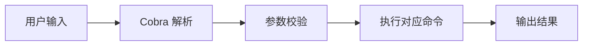

### 5.2 配置管理模块（config）

#### 5.2.1 职责

负责加载、合并和保存脚手架配置，支持配置文件、环境变量和命令行参数三种来源。

#### 5.2.2 配置优先级

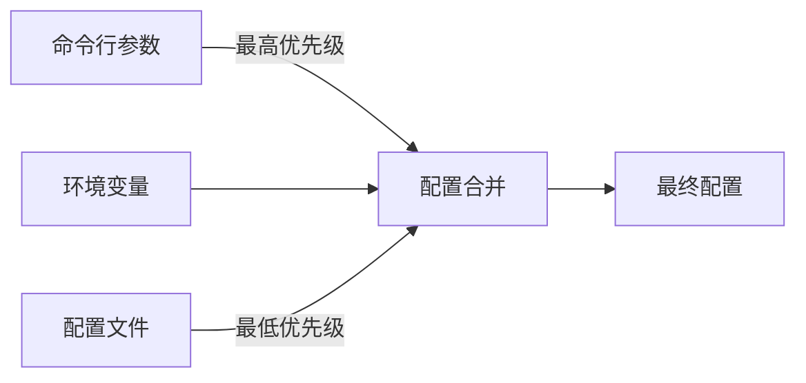

### 5.3 模板引擎模块（template）

#### 5.3.1 职责

负责加载模板文件、注入变量、渲染生成目标文件。

#### 5.3.2 模板目录结构

```
templates/
├── backend/
│   ├── echo/
│   │   ├── cmd/
│   │   ├── internal/
│   │   ├── ent/
│   │   ├── Dockerfile
│   │   └── ...
│   ├── fiber/
│   └── gin/
├── frontend/
│   ├── react/
│   ├── vue/
│   └── svelte/
├── database/
│   ├── postgres/
│   ├── mysql/
│   └── sqlite/
└── deploy/
    ├── docker/
    └── github-actions/
```

#### 5.3.3 渲染流程

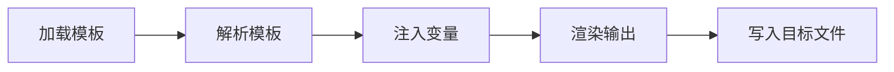

### 5.4 项目生成模块（project）

#### 5.4.1 职责

根据用户选择的技术栈和配置，调用模板引擎生成完整项目结构。

#### 5.4.2 生成流程

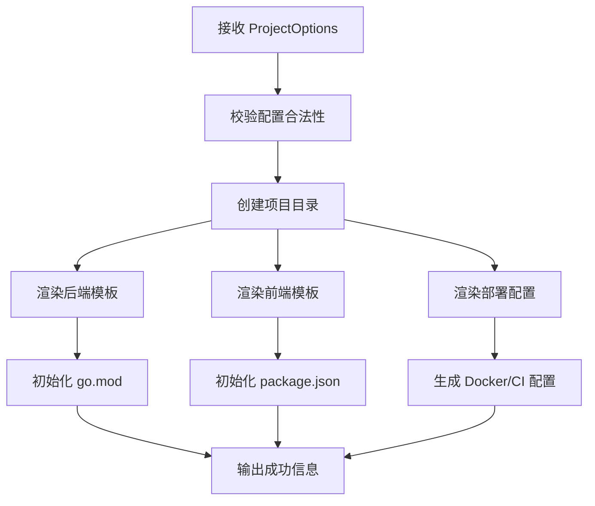

### 5.5 AI 代码生成模块（ai）

#### 5.5.1 职责

将用户自然语言描述转换为结构化输入，通过 Genkit Go Flow 调用 Ollama 模型生成代码，并对生成结果进行解析和语法校验。

#### 5.5.2 AI 生成流程

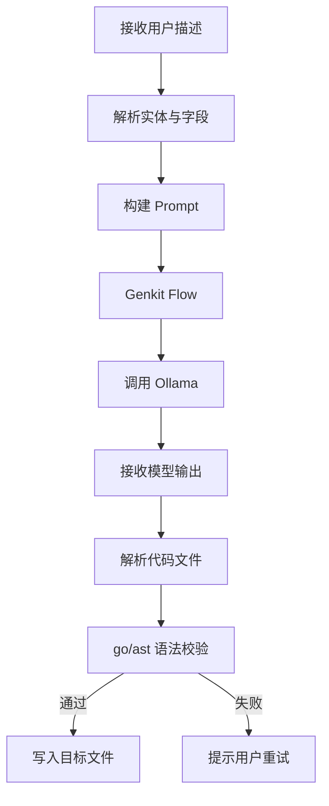

#### 5.5.3 Prompt 模板示例

```text
你是一名资深的 Go 后端开发专家。请根据以下要求生成 Go 代码：

项目技术栈：
- Web 框架：{{.Backend}}
- ORM：{{.ORM}}
- 数据库：{{.Database}}

任务：{{.Description}}

要求：
1. 仅输出 Go 代码，不要包含任何解释说明。
2. 代码需包含包声明、必要的 import、函数实现。
3. 所有函数必须处理错误并返回 error。
4. 使用 {{.Backend}} 框架的上下文处理方式。
5. 使用 {{.ORM}} 进行数据库操作。

实体信息：
{{.Entity}}
字段：
{{range .Fields}}
- {{.Name}}: {{.Type}}
{{end}}
```

### 5.6 构建打包模块（build）

#### 5.6.1 职责

负责编译生成的后端项目、构建 Docker 镜像、输出可执行文件。

#### 5.6.2 构建流程

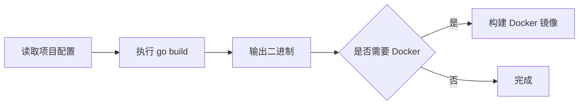

## 6. 数据流设计

### 6.1 项目初始化数据流

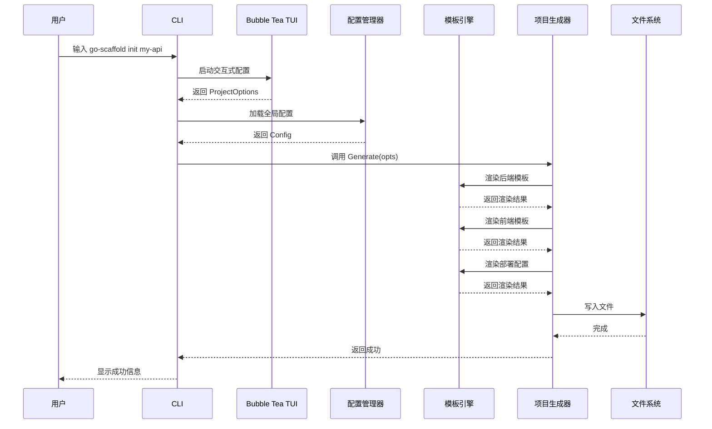

### 6.2 AI 代码生成数据流

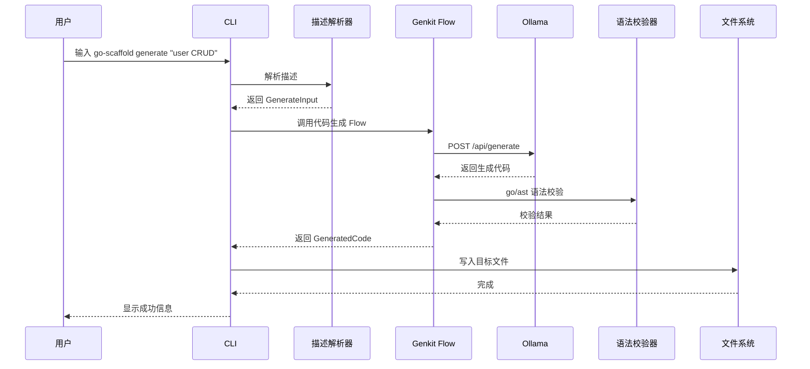

## 7. 数据持久化设计

### 7.1 脚手架自身数据

脚手架本身为无状态 CLI 工具，不直接操作数据库。配置和元数据通过以下方式持久化：

1. **全局配置文件**：`~/.go-scaffold/config.yaml`，使用 Viper 管理。
2. **项目元数据文件**：每个生成项目根目录下的 `.go-scaffold.json`，记录生成时的配置。

### 7.2 生成项目的数据库设计

生成项目使用 Ent 作为 ORM，数据库设计详见《2-4-数据库说明书.md》。

## 8. 安全设计

### 8.1 代码隐私

1. 所有 AI 推理通过本地 Ollama 完成，不将用户代码上传到远程服务器。
2. 脚手架不收集用户信息或项目内容。

### 8.2 认证安全

1. 生成的 JWT 认证项目使用环境变量配置密钥，禁止硬编码。
2. 用户密码使用 bcrypt 算法哈希存储。

### 8.3 配置安全

1. 生成项目包含 `.gitignore`，避免 `.env` 等敏感文件提交。
2. 生成项目的 Dockerfile 不复制 `.env` 文件，运行时通过环境变量注入。

## 9. 部署架构

### 9.1 开发环境部署

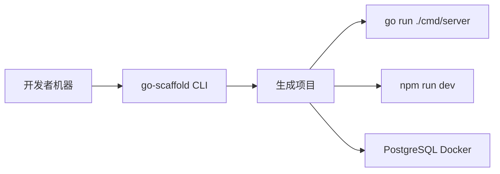

### 9.2 生产环境部署

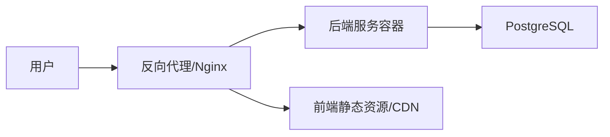

### 9.3 Docker 多阶段构建

生成的后端项目 Dockerfile 采用多阶段构建：

```dockerfile
# 阶段一：编译
FROM golang:1.23-alpine AS builder
WORKDIR /app
COPY . .
RUN go mod download
RUN CGO_ENABLED=0 GOOS=linux go build -ldflags "-s -w" -o server ./cmd/server

# 阶段二：运行
FROM alpine:latest
WORKDIR /app
COPY --from=builder /app/server .
EXPOSE 8080
CMD ["./server"]
```

## 10. 关键技术点说明

### 10.1 模板与 AI 的协同

模板引擎负责生成项目的固定骨架（目录结构、配置文件、基础代码），AI 代码生成负责根据用户描述生成动态业务代码。二者协同工作：

1. `init` 命令使用模板引擎生成完整项目。
2. `generate` 命令使用 AI 生成业务代码，并注入到已有项目中。
3. AI 生成代码时参考项目元数据（`.go-scaffold.json`），确保与项目技术栈一致。

### 10.2 语法校验机制

生成的 Go 代码需要经过语法校验，确保不会破坏项目编译。校验步骤：

1. 从模型输出中提取代码块。
2. 使用 `go/parser` 解析代码。
3. 如果解析失败，记录错误并允许重试。
4. 最多重试 3 次，超过则提示用户手动处理。

### 10.3 错误处理机制

系统统一错误分类：

| 错误类型 | 说明 | 示例 |
|:---|:---|:---|
| 配置错误 | 配置文件缺失或格式错误 | 无法读取 ~/.go-scaffold/config.yaml |
| 文件系统错误 | 目录已存在、权限不足 | 项目目录 my-api 已存在 |
| 模板错误 | 模板文件缺失或渲染失败 | 模板 backend/echo/main.go.tpl 未找到 |
| AI 服务错误 | Ollama 未启动或模型不可用 | 无法连接到 Ollama: localhost:11434 |
| 构建错误 | 编译或 Docker 构建失败 | go build 失败：xxx |

## 11. 附录

### 11.1 技术栈清单

| 层级 | 技术 | 版本 |
|:---|:---|---:|
| CLI 框架 | Cobra | v1.8+ |
| TUI 框架 | Bubble Tea | v1.1+ |
| 配置管理 | Viper | v1.19+ |
| 日志 | log/slog | 标准库 |
| 后端框架 | Echo | v4.12+ |
| ORM | Ent | v0.14+ |
| 数据库驱动 | lib/pq | v1.10+ |
| AI 框架 | Genkit Go | v0.9+ |
| 本地模型 | Ollama | v0.3+ |
| 前端框架 | React | v19+ |
| 构建工具 | Vite | v5+ |
| 类型生成 | openapi-typescript | v7+ |
| 容器化 | Docker | v24+ |

### 11.2 设计变更记录

| 版本 | 日期 | 修改内容 | 作者 |
|:---:|:---:|:---|:---|
| v1.0 | 2025-10-01 | 初稿完成 | 项目小组 |
